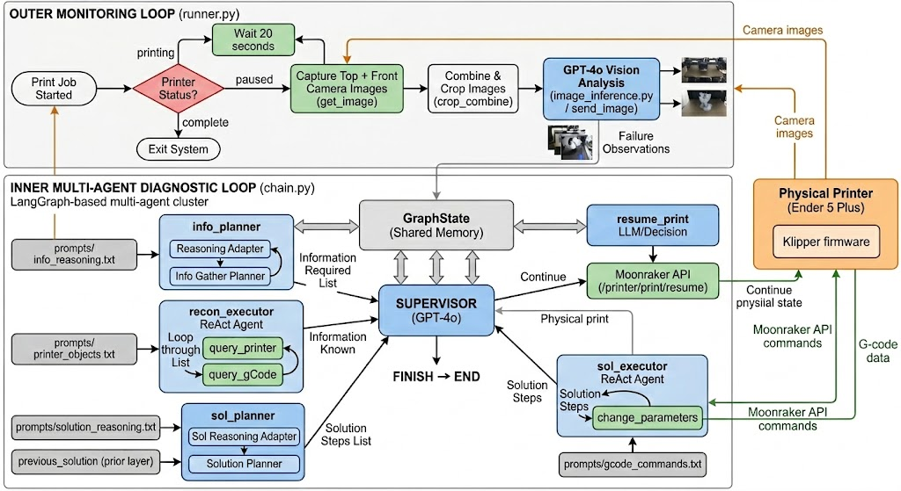

# Agentic AI for FDM 3D Printing Process Control

An autonomous LLM-based system that monitors, diagnoses, and corrects 3D printing defects in real time using a multi-agent Supervisor-Worker architecture built with LangChain, LangGraph, and GPT-4o.

Developed for **Carnegie Mellon University, 24-641: Agentic LLM Manufacturing Control (Spring 2026)**.

Based on code from CMU's Mechanical and Artificial Intelligence Lab (MAIL):
[LLM-3D-Print: Large Language Models to Monitor and Control 3D Printing](https://github.com/BaratiLab/LLM-3D-Print-Large-Language-Models-To-Monitor-and-Control-3D-Printing)

## Demo Video

https://github.com/user-attachments/assets/demo.mp4

<video src="demo.mp4" width="720" autoplay loop muted></video>

> *Video is sped up 2x. Full-length version with audio:* [Watch on Box](https://cmu.box.com/s/66qr8169kwcv31eveyu4qsd7v5mw6ppq)

The video shows the full pipeline: defect injection at 250°C, image capture, GPT-4o vision analysis, multi-agent diagnosis, autonomous parameter correction, and print resume.

## System Architecture



The system consists of two layers:

**Outer Monitoring Loop** (`runner.py`): Polls the printer status via Moonraker API. When the print is paused, it captures a webcam image and sends it to GPT-4o Vision for defect analysis, then invokes the inner diagnostic loop.

**Inner Multi-Agent Diagnostic Loop** (`chain.py`): A LangGraph state machine with a Supervisor (GPT-4o) that delegates to five worker agents:

| Agent | Role | Tools |
|-------|------|-------|
| `info_planner` | Adapts reasoning modules and plans what to query from the printer | -- |
| `recon_executor` | Queries printer state via Moonraker API | `query_printer`, `query_gCode` |
| `sol_planner` | Plans corrective G-code commands based on defects and printer state | -- |
| `sol_executor` | Executes G-code corrections on the printer | `change_parameters` |
| `resume_print` | Resumes the paused print job | Moonraker REST API |

**Flow:** Supervisor -> info_planner -> recon_executor -> sol_planner -> sol_executor -> resume_print -> FINISH

## Hardware & Software Stack

- **Printer:** Creality Ender V3 SE
- **Firmware:** Klipper + Moonraker (API middleware) + Mainsail (web UI)
- **Compute:** Raspberry Pi (printer host) + local workstation (LLM agent)
- **LLM:** OpenAI GPT-4o (vision + reasoning)
- **Framework:** LangChain, LangGraph, LangSmith

## Project Structure

```
├── chain.py                 # Multi-agent graph definition (Supervisor-Worker)
├── runner.py                # Outer monitoring loop (polls printer, captures images)
├── tools.py                 # LangChain tools (query_printer, change_parameters, etc.)
├── image_inference.py       # GPT-4o Vision pipeline for defect detection
├── parsing_utils.py         # Pydantic output parsers for structured LLM responses
├── utils.py                 # File loading utilities
├── snapshoter.py            # Standalone printer monitoring / snapshot script
├── chain_original.py        # Original chain.py before modifications
├── prompts/                 # Prompt files for each agent stage
│   ├── image_system_prompts.txt
│   ├── image_user_prompt.txt
│   ├── info_reasoning.txt
│   ├── solution_reasoning.txt
│   ├── gcode_commands.txt
│   ├── gcodes_query.txt
│   ├── printer_objects.txt
│   ├── info_gather_planner_prompt.txt
│   ├── system_prompt.json
│   └── originals/           # Backup of all original prompts (pre-modification)
├── printer_config/          # Klipper printer configuration files
│   ├── printer.cfg
│   ├── crowsnest.conf
│   ├── macros.cfg
│   └── timelapse.cfg
├── results/                 # Test run data (logs, images, agent outputs)
│   ├── run_0_baseline/
│   ├── run_1_defect_high_temp/
│   ├── run_2_prompt_remove_temp_guard/
│   ├── run_3_prompt_strict_rating/
│   ├── run_4_prompt_thermal_focus/
│   ├── run_5_prompt_solution_priority/
│   └── run_6_prompt_temp_check_reasoning/
├── Overview.jpg             # System architecture diagram
├── environment.yml          # Conda environment specification
└── .env                     # OpenAI API key (not tracked)
```

## Setup

### Prerequisites
- Python 3.11+
- Access to a 3D printer running Klipper + Moonraker + Mainsail
- OpenAI API key with GPT-4o access

### Installation

1. Clone the repository:
   ```bash
   git clone https://github.com/jabarkle/AgenticAI-FDM-Printing.git
   cd AgenticAI-FDM-Printing
   ```

2. Create the conda environment:
   ```bash
   conda env create -f environment.yml
   conda activate llmprinter
   ```

3. Create a `.env` file with your API key:
   ```bash
   echo "OPENAI_API_KEY=your-key-here" > .env
   ```

4. Update the printer URL in `runner.py` (line ~19):
   ```python
   printer_url = "YOUR_PRINTER_IP:PORT"
   ```

### Running

1. Start a print job on Mainsail and pause it at the desired layer.
2. Run the agent:
   ```bash
   python runner.py
   ```
3. The system will capture an image, analyze defects, query printer state, apply corrections, and resume the print automatically.

## Test Runs & Prompt Engineering

Seven test runs were conducted to evaluate the system and study how prompt changes affect agent behavior:

| Run | Description | Prompt Change | Defect Rating | Temp Correction |
|-----|-------------|---------------|---------------|-----------------|
| 0 | Baseline (normal print) | None | 9/10 | N/A |
| 1 | High temp defect (250°C) | None | 5/10 | 205°C |
| 2 | Guardrail removal | Removed 205°C limit from `chain.py` | 5/10 | **210°C** |
| 3 | Strict rating criteria | Stricter grading in `image_user_prompt.txt` | **4/10** | 205°C |
| 4 | Thermal-focused detection | Narrowed detection in `image_system_prompts.txt` | 9/10 | 200°C |
| 5 | Solution prioritization | Reordering in `solution_reasoning.txt` | 8/10* | 205°C |
| 6 | Temp-check reasoning | Added temp query to `info_reasoning.txt` | 10/10 | 205°C |

\*Run 5 rating was hallucinated (GPT-4o failed to process the image).

Each run folder in `results/` contains the full agent output logs, defect analysis, corrective G-code commands, and Mainsail screenshots.

## Code Modifications from Original

Key changes made to the [original BaratiLab codebase](https://github.com/BaratiLab/LLM-3D-Print-Large-Language-Models-To-Monitor-and-Control-3D-Printing):

- **Camera handling**: Modified `runner.py` and `snapshoter.py` for single-camera setup (original assumed dual cameras)
- **Image processing**: Bypassed broken dual-camera crop logic in `crop_combine`; passes single image through
- **Duplicate image fix**: Prevented same image from being sent as both current and previous layer to GPT-4o
- **Temperature query hint**: Added prompt guidance in `chain.py` to use `query_printer("extruder")` instead of M105 G-code
- **Bug fixes**: Fixed f-string formatting, trailing commas, duplicate dict keys, and syntax errors across prompt files

## Authors

Ryan Kiachian, Jesse Barkley, Maciej Sobolewski, Tom Wei

Carnegie Mellon University, Spring 2026
